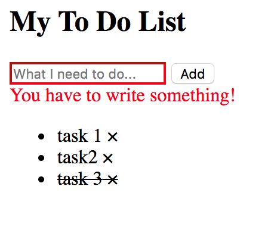

Tasks
=====

DOM Manipulation and Events
---------------------------

### Task 1

Create a TODO list for adding different tasks for the week. You have an input
element for typing the TODO tasks, a button for adding the task in a list, a
button for removing tasks next to every task.

1.  Get the value from the input and put it in the list when the user presses
    the ‘Add’ button

2.  Delete the task when the user presses the ‘Delete’ button

3.  Highlight the tasks when the user hovers it

4.  When the user clicks on a task, cross it out/mark it as done (use the css
    property ‘text-decoration:line-through;’)

5.  If the task is marked as done and the user clicks on it, remove the
    \`line-through\` property

6.  Add validation when the user presses the ‘Add’ button and there isn’t value
    in the input element show a message and outline the input in red

7.  Add a validation in the input while the user is typing to not type more than
    50 symbols.

8.  Submit a task when the user presses the ‘Enter button’

String and Arrays
-----------------

### Task 2

Write a program that checks if a given string is a palindrome. A palindrome is a
string that if reverted looks identical to the original string. The program
should be case insensitive and should ignore any spaces and commas.

Examples:

-   abcdcba – true

-   ABCdcba – true

-   ABC dc,,,,ba – true

-   Abbsd = false

### Task 3

You are given a string that contains letters, digits and commas. You should
write a program that removes all the letters and returns the sum of all numbers
separated by commas.

Examples:

-   "1,2a,,,sd,3asd3" – 36

-   "asdasd1,asASDAsd" – 1

-   "asdasdamasdad,,,,asd,a,sd" – 0

### Task 4

You are given a string containing digits, commas and semicolons. This string
represents a 2-dimensional array. The semicolons separate the rows and the
commas separate the values of each row. You should write a program that
calculates the sum of each of the rows and then returns a list containing the
sums in sorted order starting from the biggest one. If a row is empty its sum is
considered 0. The list should be returned in the form of a string and the values
should be separated by the pipe symbol "\|"

Examples:

-   "1,2,3;3,4,5,6;;1,2" - "12\|6\|3\|0"

-   “1,1;2,2,1,2,4;12;” – “12\|11\|2\|0”

### Task 5

You are given a string containing letters, digits, spaces, commas and dots. You
should find the sum of the ascii code of the characters of each word. A word is
considered anything consisting of letters and/or digits. You should return a
list of all the sums in ascending order.

Examples:

-   "Aa.aA .b" – 98,162,162

-   “12,ds,,,B” – 66,99,215

OOP
---

### Task 5 - Animal Kingdom

Design an animal kingdom using two different implementation patters: By using
prototype and by using ES6 classes.

1.  Define an Animal

    1.  Properties:

        1.  Name

        2.  diet

    2.  Methods:

        1.  sleep(hours) - console logs "Animal sleeping for n hours"

        2.  move(movement) - console logs "Animal is" and the movement passed as
            input

        3.  eat() - console logs "Animal is eating" and the diet class property

2.  Define a Dog

    1.  Properties:

        1.  Breed

    2.  Methods:

        1.  bark() - console logs "Woof"

3.  Define a Cat

    1.  Properties:

        1.  Sound

    2.  Methods:

        1.  makeSound() - console logs the sound class property

4.  Define a Lion

    1.  Properties:

        1.  Sound

    2.  Methods:

        1.  makeSound() - console logs the sound class property

Functions
---------

### Task 6

Given the Dog and the Cat objects, complete the last two lines of code so that
the dog says "meow" and cat says "woof".

let cat = {

sound: "Meow",

makeSound: function() {

console.log(this.sound);

}

};

let dog = {

sound: "Woof",

makeSound: function() {

console.log(this.sound);

}

};

// Should log "Meow"

dog.makeSound...

let catMakeSound = cat.makeSound...

// Should log "Woof"

catMakeSound();

### Task 7

Define a function called "sum" with a number for an input parameter. On
invocation the function should return another function which also takes a number
for input. On invocation of the returned fuction it should return the sum of the
parameter passed to the first function and the parameter passed to the second
function returned from the first one.

### Task 8

Define a function called "evenOrOdd" which accepts two functions as parameters.
The first function logs in the console "Even" while the second one logs "Odd".
On invocation "evenOrOdd" should return a function which accepts as a parameter
a number. If the number is even the first parameter function of "evenOrOdd"
should be called and if the number is odd - the second parameter fucntion.
